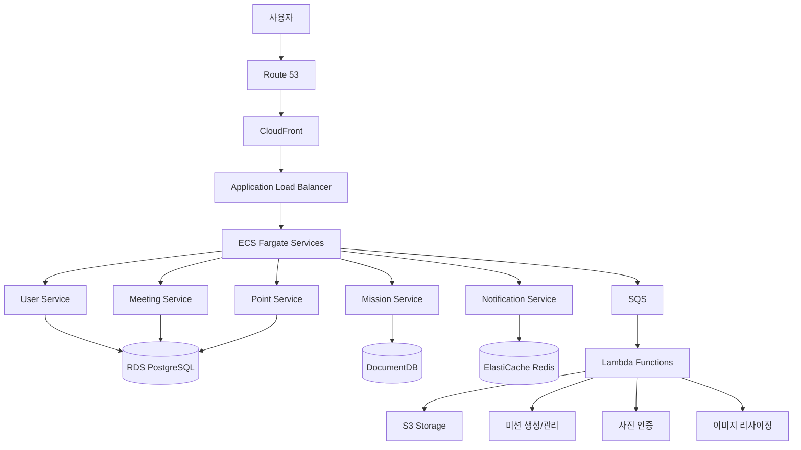

# 할사람? - 미션 인증 기반 번개 플랫폼

## 프로젝트 개요

### 기본 정보
- **프로젝트명**: 할사람? (오늘 만나서 미션 ~할 사람?)
- **팀명**: 아마존 뚝딱 (5팀)
- **주관**: 한국소프트웨어산업협회 [NIPA-AWS] Developer 부트캠프 2기
- **개발기간**: 3주 (2024.07.28 ~ 2024.08.18)

### 서비스 컨셉
**AI 기반의 랜덤 미션을 인증하는 번개 모임 플랫폼**

번개를 미션처럼, 모임을 게임처럼! 일상적이고 재미있는 랜덤 미션을 통해 부담없는 번개 만남을 유도하고, 앱테크를 모티브로 한 포인트 제도로 사용자의 지속적인 참여와 지역 커뮤니티 활성화를 목표로 한다.

### 서비스 핵심 기능
1. **랜덤 미션**: AI 기반 일상적이고 재미있는 미션 생성
2. **번개 모임**: 부담없는 오프라인 만남 기회 제공
3. **포인트 제도**: 미션 수행 시 보상으로 포인트 지급 (기프티콘 교환 가능)

### 미션 예시
- "특정 송리단길 맛집에서 디저트 사서 나눠 먹기"
- "오늘 저녁 7시에 송파근린공원에서 모여서 배드민턴 30분 치기"
- "석촌호수 한 바퀴 산책하기"

## 팀원 구성 및 역할
| 역할                | 담당 업무                           |
| ----------------- | ------------------------------- |
| 팀장/미션 사진 검증       | 미션 사진 인증 Lambda 개발              |
| 인프라 구축, 검수 페이지 개발 | 배포 및 인프라 구축                     |
| 미션 생성 및 검수        | 미션 생성/관리 및 검수 Lambda 개발         |
| **서비스 개발 (본인)**   | **React 프론트엔드 및 NestJS 백엔드 개발** |

## 기술 스택

### Frontend
- **React**: 웹 애플리케이션 개발
- **TypeScript**: 타입 안정성 확보
- **Zustand**: 상태 관리 라이브러리
- **Styled Components**: CSS-in-JS 스타일링
- **PWA**: 프로그레시브 웹 앱 구현
- **CloudFront**: CDN 서비스
- **Route 53**: 도메인 관리

### Backend
- **NestJS**: 백엔드 프레임워크
- **TypeScript**: 타입 안정성 확보
- **JWT**: 인증 시스템
- **TypeORM**: 데이터베이스 ORM
- **ECS Fargate**: 컨테이너 기반 마이크로서비스
- **Application Load Balancer**: 로드 밸런싱

### Database & Cache
- **RDS PostgreSQL**: 사용자, 모임 정보 저장
- **DocumentDB**: 미션 데이터 저장
- **ElastiCache Redis**: 세션 및 실시간 데이터 캐싱

### Storage & Processing
- **S3**: 웹 애플리케이션, 미션 증빙사진, 로그 저장 (용도별 분리된 버킷)
**- **Lambda****:
  - 미션 생성 및 관리
  - 미션 사진 인증
  - 이미지 리사이징, 알림 발송 등 비동기 처리
- **SQS**: 메시지 큐 시스템

### Monitoring & CI/CD
- **CloudWatch**: 모니터링 및 로깅
- **CodePipeline**: 자동화된 배포 시스템
- **Docker**: 컨테이너화

> [!NOTE] - **GitHub Actions**: CI/CD 파이프라인

## 개발 로드맵 (MVP)

### 1단계: 기초 인프라 구축
- 회원가입 및 로그인
- 신원인증 시스템
- 기본 UI/UX 구성

### 2단계: 메인 기능 개발
- 미션 리스트 조회
- 모임 생성 및 참여
- 사용자 매칭 시스템

### 3단계: 미션 인증 시스템
- QR 코드 기반 출석체크
- 미션 수행 인증
- 포인트 적립 시스템

### 4단계: 사용자 경험 완성

> [!NOTE] - 피드백 시스템
- 마이페이지
- 포인트 교환 기능

## 서비스 플로우
1. **미션 발견**: 사용자가 앱에서 흥미로운 미션 발견
2. **모임 참여**: 원하는 모임에 참여 신청
3. **출석 체크**: 모임 당일 호스트의 QR코드 스캔으로 출석체크
4. **미션 수행**: 참가자들과 함께 미션 수행

> [!NOTE] 5. **피드백**: 모임 종료 후 상호 피드백 작성
6. **보상 지급**: 미션 완료 시 포인트 지급
7. **포인트 활용**: 기프티콘으로 교환

## 시퀀스 다이어그램
```mermaid
sequenceDiagram
    participant U as 사용자
    participant W as 웹 애플리케이션
    participant A as API Gateway
    participant Auth as Auth Service
    participant US as User Service
    participant MS as Mission Service
    participant MTS as Meeting Service
    participant PS as Point Service
    participant DB as Database
    participant S3 as S3 Storage
    participant Admin as 관리자

    %% 1. 사용자 온보딩 플로우
    Note over U, Admin: 1. 사용자 온보딩 및 인증
    U->>W: 회원가입 요청
    W->>A: POST /auth/signup
    A->>Auth: 회원가입 처리
    Auth->>US: 사용자 정보 저장
    US->>DB: INSERT user_info
    DB-->>US: 저장 완료
    US-->>Auth: 사용자 생성 완료
    Auth->>U: 신원 인증 요청
    U->>Auth: 신원 인증 정보 제출
    Auth->>DB: 인증 정보 저장
    Auth-->>W: 인증 완료
    W-->>U: 지역/관심사 설정 페이지

    U->>W: 송파구 선택 + 관심사 설정
    W->>A: PUT /users/profile
    A->>US: 프로필 업데이트
    US->>DB: UPDATE user_profile
    US-->>W: 설정 완료
    W-->>U: 메인 페이지 이동

    %% 2. 모임 생성 플로우
    Note over U, Admin: 2. 모임 생성 플로우
    U->>W: 미션 페이지 접속
    W->>A: GET /missions
    A->>MS: 미션 목록 조회
    MS->>DB: SELECT missions
    DB-->>MS: 미션 데이터
    MS-->>W: 미션 목록 반환
    W-->>U: 포인트별 미션 목록 표시

    U->>W: 특정 미션 선택
    W->>A: GET /missions/{id}
    A->>MS: 미션 상세 조회
    MS-->>W: 미션 상세 정보
    W-->>U: 미션 상세 페이지

    U->>W: 모임 생성하기
    W->>A: POST /meetings
    A->>MTS: 모임 생성 요청
    MTS->>DB: INSERT meeting_info
    DB-->>MTS: 모임 생성 완료
    MTS-->>W: 모임 ID 반환
    W-->>U: 모임 생성 완료, 참여자 모집 중

    %% 3. 모임 참여 플로우
    Note over U, Admin: 3. 모임 참여 플로우
    U->>W: 번개 리스트 조회
    W->>A: GET /meetings/active
    A->>MTS: 활성 모임 목록 조회
    MTS->>DB: SELECT active_meetings
    DB-->>MTS: 활성 모임 데이터
    MTS-->>W: 모임 목록 반환
    W-->>U: 지도와 함께 모임 목록 표시

    U->>W: 모임 참여 신청
    W->>A: POST /meetings/{id}/join
    A->>MTS: 참여 신청 처리
    MTS->>DB: INSERT meeting_participant
    DB-->>MTS: 참여 등록 완료
    MTS-->>W: 참여 승인
    W-->>U: 참여 완료, 모임 대기

    %% 4. 모임 진행 및 미션 수행
    Note over U, Admin: 4. 모임 진행 및 미션 수행
    Note over U: 모임 당일
    U->>W: 현장 도착, 출석체크 요청
    W->>A: POST /meetings/{id}/checkin
    A->>MTS: QR 코드 생성 요청
    MTS-->>W: QR 코드 데이터
    W-->>U: 호스트용 QR 코드 표시

    loop 참여자별 출석체크
        U->>W: QR 코드 스캔
        W->>A: POST /meetings/{id}/scan
        A->>MTS: 출석 확인
        MTS->>DB: UPDATE attendance
        MTS-->>W: 출석 완료
        W-->>U: 출석 확인
    end

    U->>W: 미션 수행 시작
    Note over U: 미션 활동 진행
    U->>W: 미션 완료, 증빙자료 업로드
    W->>S3: 파일 업로드 (사진/영상)
    S3-->>W: 업로드 완료, URL 반환
    W->>A: POST /missions/{id}/evidence
    A->>MS: 증빙자료 등록
    MS->>DB: INSERT mission_evidence
    DB-->>MS: 등록 완료
    MS-->>W: 검수 대기 상태
    W-->>U: 업로드 완료, 검수 대기

    %% 5. 관리자 검수 및 포인트 지급
    Note over U, Admin: 5. 관리자 검수 및 포인트 지급
    Admin->>W: 검수 대기 목록 조회
    W->>A: GET /admin/evidence/pending
    A->>MS: 대기 목록 조회
    MS-->>Admin: 검수 대기 목록

    Admin->>W: 증빙자료 승인/반려
    W->>A: PUT /admin/evidence/{id}/review
    A->>MS: 검수 결과 처리
    MS->>DB: UPDATE evidence_status

    alt 승인된 경우
        MS->>PS: 포인트 지급 요청
        PS->>DB: INSERT point_transaction
        PS-->>U: 포인트 지급 알림
        U->>W: 포인트 확인
        W->>A: GET /users/points
        A->>PS: 포인트 조회
        PS-->>U: 현재 포인트 표시
    else 반려된 경우
        MS-->>U: 재업로드 요청 알림
    end


> [!NOTE] %% 6. 모임 완료 및 피드백 Note over U, Admin: 6. 모임 완료 및 피드백 U->>W: 피드백 작성
    W->>A: POST /meetings/{id}/feedback

> [!NOTE] A->>MTS: 피드백 저장
    MTS->>DB: INSERT feedback

> [!NOTE] MTS-->>W: 피드백 완료
    W-->>U: 모임 기록 저장 완료

    %% 7. 포인트 사용
    Note over U, Admin: 7. 포인트 마켓 이용
    U->>W: 포인트 마켓 접속
    W->>A: GET /market/items
    A->>PS: 상품 목록 조회
    PS-->>W: 교환 가능 상품 목록
    W-->>U: 포인트 마켓 표시

    U->>W: 상품 교환 요청
    W->>A: POST /market/exchange
    A->>PS: 포인트 차감 및 교환 처리
    PS->>DB: UPDATE user_points
    PS-->>W: 교환 완료
    W-->>U: 교환 완료 알림
```

## AWS 시스템 아키텍처


### 마이크로서비스 구성
- **User Service**: 사용자 관리
- **Mission Service**: 미션 생성 및 관리  
- **Meeting Service**: 모임 생성 및 관리
- **Point Service**: 포인트 적립 및 교환
- **Notification Service**: 알림 서비스

### 데이터 흐름


## Q&A

### Q1: 기존 모임 플랫폼과의 차별점은?
**A**: 기존 플랫폼들은 '만나자'에서 끝나지만, 할사람은 '만나서 뭘 하자'까지 제시한다.
- **미션 중심**: 랜덤 미션으로 매번 새로운 경험 제공
- **게임화**: 포인트, 레벨, 뱃지로 재미와 지속성 확보
- **목적성**: 단순 수다가 아닌 함께 할 활동이 명확
- **보상**: 앱테크처럼 실제 기프티콘 교환 가능

### Q2: 사진만으로는 위조가 가능하지 않을까?
**A**: 다층 인증 시스템을 설계하고 구현할 예정이다.
- **(MVP 기능) QR 출석체크**: 호스트가 생성한 QR코드로 1차 인증
- **(확장성) 실시간 사진**: 모임 중 찍은 사진 업로드
- **(확장성) 위치 기반**: GPS 메타데이터로 장소 확인

### Q3: 사용자의 어떤 페인포인트를 해결하는가?
**A**: '새로운 사람은 만나고 싶은데, 뭘 해야 할지 모르겠어'라는 고민을 해결한다.
- **만남의 목적 부재**: "만나서 뭘 하지?" → 구체적이고 재미있는 미션 활동 제공
- **초면의 어색함**: 대화 소재 부족 → 미션이라는 공통 목표로 자연스러운 소통
- **경제적 부담감**: 모임 비용 부담 → 포인트 보상으로 오히려 수익 창출 기회
- **사회적 단절감**: 1인 가구 증가, 재택근무 확산 → 부담 없는 오프라인 만남 기회

### Q4: 낯선 사람과의 대면만남, 안전성은 어떻게 보장되는가?
**A**: **안전한 공간에서, 검증된 사람들과, 투명한 활동**을 원칙으로 한다.
- **SMS 번호 인증**: 본인 확인을 위한 휴대폰 인증
- **지역 인증**: GPS를 통한 위치 확인

> [!NOTE] - **신뢰도 점수 시스템**: 참여 이력과 피드백을 기반으로 한 사용자 신뢰도 - **신고 및 피드백 시스템**: 부적절한 행동에 대한 신고 기능 - **공개적인 장소 미션**: 안전한 공공장소에서의 활동으로 제한

### Q5: ECS를 선택한 이유는?
**A**: AWS ECS(Fargate)를 활용하여 컨테이너 기반의 서비스 단위 운영이 가능하고, 인프라 관리 부담 없이 서비스의 확장성과 유지보수성을 확보할 수 있기 때문이다.

### Q6: 수익 구조는?
**A**: 초기에는 사용자 확보에 집중하되, 향후 다양한 수익 모델을 적용할 예정이다.
- **광고 수익**: 지역 상권과 연계한 타겟팅 광고
- **기업 스폰서십**: 브랜드 체험 미션, 제품 홍보 미션 제공
- **프리미엄 서비스**: 우선 미션 참여권, 특별 미션 접근 등
- **커미션**: 미션 관련 상품 구매 시 제휴 수수료

### Q7: AI 기반 미션 생성의 구체적인 기술은?
**A**: 단계적으로 AI 기술을 도입할 계획이다.
- **MVP 단계**: 미리 정의된 미션 템플릿을 조합하는 룰 베이스 시스템
- **1차 고도화**: OpenAI API를 활용한 자연어 기반 미션 생성
- **2차 고도화**: 사용자 선호도, 날씨, 지역 정보를 학습한 개인화 추천

## 향후 발전 방향

### 단기 목표
- **송파구 지역 MVP 서비스 런칭**: 기본 회원가입, 미션 생성, 모임 참여, 포인트 시스템 구현

> [!NOTE] - **핵심 기능 검증**: QR 코드 출석체크, 미션 인증, 피드백 시스템 작동 확인
- **초기 사용자 확보**: 테스트 사용자 20명 이상 확보를 통한 서비스 검증

### 장기적 확장 가능성
향후 서비스가 안정화되면 서울 전 지역 확대, AI 미션 생성 알고리즘 고도화, 전국 서비스 확장, 공공기관 연계를 통한 지역 경제 활성화, 다양한 미션 카테고리 확장(운동, 문화, 봉사활동 등), 기업 연계 미션 및 마케팅 플랫폼으로의 발전 등을 고려할 수 있다.

## 관련 링크
- [주제발표 프레젠테이션 자료](https://www.canva.com/design/DAGwn2UZKZs/4phLBWk4OCrzfSF00n21sA/edit?utm_content=DAGwn2UZKZs&utm_campaign=designshare&utm_medium=link2&utm_source=sharebutton)